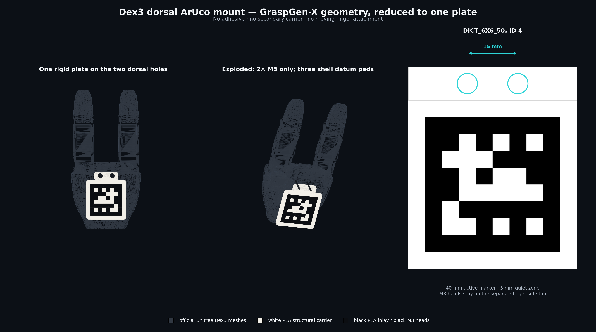

# G1 camera calibration and fixtures

Calibration capture and analysis tools, with printable marker mounts for the
head-mounted RealSense and Dex3 hands on the Unitree G1.

[](https://sri299792458.github.io/g1-research-docs/perception/targets.html#dex3-dorsal-markers)

*Right-hand wrist-marker mount: CAD placement and attachment geometry. See the
guide for photographs, print files and fitting details.*

**[Calibration workflow](https://sri299792458.github.io/g1-research-docs/calibration/workflow.html)** ·
[Full G1 guide](https://sri299792458.github.io/g1-research-docs/) ·
[Documentation source](https://github.com/sri299792458/g1-research-docs)

Use this repository to capture camera/joint observations, fit and evaluate a
calibration, or reproduce the wrist-marker fixtures. It includes both wrist
mounts, the selected August calibration bundle, and the later V7 torso mount
with R2 fit coupons. The V7 assembly still has
[physical fit limits](artifacts/g1_mount_v7/FIT_STATUS.md).

Physical cube stacking, control integration and episode recording live in
[g1-dex3-tabletop](https://github.com/sri299792458/g1-dex3-tabletop).
Generic printed targets and detection live in the
[AprilCube fork](https://github.com/sri299792458/aprilcube).

## Choose a starting point

| Task | Files to open |
| --- | --- |
| Print or fit a wrist marker | [Mount guide](docs/dex3_dorsal_aruco_mount.md), [right ID 4](cad/dex3_dorsal_aruco_mount/), [left ID 5](cad/dex3_dorsal_aruco_mount_id5/) |
| Inspect the current torso mount | [V7 guide](artifacts/g1_mount_v7/README.md), [physical fit status](artifacts/g1_mount_v7/FIT_STATUS.md), [R2 coupons](artifacts/g1_coupon_r2/README.md) |
| Edit native torso CAD | [Fusion/mesh script guide](scripts/G1_MOUNT_README.md), [native archive](artifacts/g1_mount_v7/cad/G1_calibration_mount_native.f3d), [STEP](artifacts/g1_mount_v7/cad/G1_calibration_mount_assembly.step) |
| Inspect the selected calibration | [Bundle guide](docs/calibration-bundle.md), [bundle JSON](config/calibrations/dex3_shared_20260812_selected_free.json) |
| Understand capture and native fitting | [CLI reference](docs/calibration-cli.md), `src/g1_aprilcube_calibration/session_store.py`, `dataset_builder.py`, `robot_calibration_bridge.py`, `calibration_evaluation.py` |
| Understand control handback | [Commissioning evidence and recovery](docs/g1_control_state_and_recovery.md), [current guide](https://sri299792458.github.io/g1-research-docs/control/ownership.html) |

## What is established

The wrist targets use 40 mm `DICT_6X6_50` markers, right ID 4 and left ID 5.
Their matched profiles enforce the arm and marker identity. The two palm frames
have different dorsal directions; use the handed transforms in
`src/g1_aprilcube_calibration/dex3_dorsal_mount.py`.

The August 12 bundle preserves the shared-camera fit and selected joint offsets
used by the August 25 stacking baseline. Its original validation record reports
model-fit evidence, not an independent accuracy specification for another robot.
The bundle materializes a separate calibrated URDF and checks the original
URDF's hash. It does not require the original recordings to be present.

V7 is the current torso structure: two broad crossbars and two side plates
supporting the existing 210 × 300 mm carrier. Its 180 × 270 mm ChArUco pattern
and four M4 holes are preserved. Recorded CAD checks are available alongside
the exports. **The complete V7 assembly has not been physically qualified.**
Upper M6 × 25 worked in the reported R2 coupon trial; lower M6 × 25 did not
engage through the coupon. Lower screw length, upper engagement details,
assembly stiffness, reinstall repeatability and calibration accuracy remain
unresolved. Consult the fit status before choosing hardware.

The pre-R2 meshes under `original_reference/` and `precision_reference/` are
inputs to the comparison checks. Current print files are under `print_parts/`
and `fit_coupons/`; reference meshes are not alternative current designs.

## Offline setup

CAD exports and the supplied Bambu projects can be opened without installing the
Python package. The Python tools expect two independent checkouts at the root:

```bash
git clone https://github.com/sri299792458/aprilcube.git aprilcube
git -C aprilcube checkout --detach 80ed7c72ed00aef6dc70f77d8169a199e9a612cd
git clone https://github.com/unitreerobotics/unitree_ros.git unitree_ros
git -C unitree_ros checkout --detach f3772ce54c56ef2d34c6aee8100bc768896c7d19
uv sync --python /usr/bin/python3 --group dev
```

These are the revisions used by the inspected calibration checkout. Keep the
system interpreter aligned with ROS for later hardware use: Python 3.10 for
Humble or Python 3.12 for Jazzy, with NumPy 1.x. The editable AprilCube dependency
and its models must be available before `uv sync`.

An offline bundle inspection creates no robot connection:

```bash
.venv/bin/g1-calib inspect-calibration-bundle \
  --calibration-bundle config/calibrations/dex3_shared_20260812_selected_free.json \
  --urdf config/urdf/g1_29dof_rev_1_0_g1pilot_collision.urdf
```

The Fusion scripts require Autodesk Fusion's `adsk` API. Mesh checks and Bambu
comparisons have additional dependencies described in their
[script guide](scripts/G1_MOUNT_README.md). Running a CAD builder changes its
active design; opening an exported model does not require running a builder.

## Repository boundaries

`src/`, `tools/`, and `tests/` retain the calibration implementation and its
regressions. `config/` contains matched profiles and upstream pins. `cad/` and
`artifacts/` contain the current fixtures, their source assets and recorded CAD
checks. The included tests are offline contracts; passing them does not
commission a hardware command or validate a physical mount.

Raw recordings, experiment work directories, private running notes and internal
design proposals are kept outside the public tree. Paths under `sessions/`,
`runs/`, or `work/` in provenance identify retained source evidence; they are not
downloads bundled with this repository. Selected manipulation datasets are
released separately in LeRobot format after conversion and review.

Generated handoff ZIPs are not duplicated in Git. The packaging scripts can
assemble them from the maintained files. Existing upstream notices, including
the Unitree model license with the frozen V7 inputs, remain with those assets.

Research and original implementation by
[sri299792458](https://github.com/sri299792458), building on Unitree, AprilCube
and Mike Ferguson's `robot_calibration`. This consolidation retains the V7
implementation and the local calibration-bundle addition without importing
private development history.
