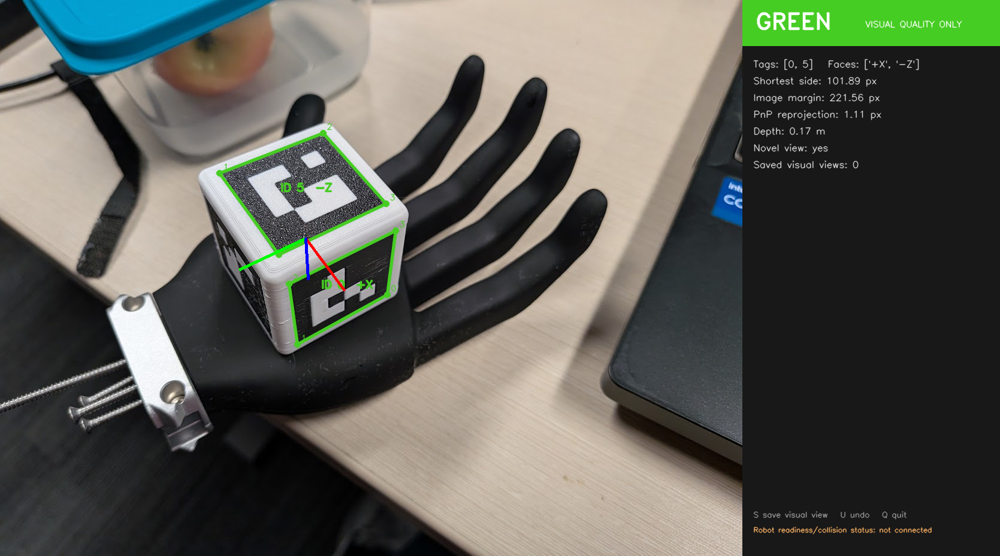

# G1 RealSense–AprilCube calibration prototype

This workspace is building a lightweight calibration path for the head-mounted
RealSense on a mode-5 Unitree G1. The camera observes the rounded AprilCube
rigidly taped to the palm of the left dummy hand. The arm side is a pose-set and
runtime argument (`calibration_arm: left` here), not a separate hard-coded
workflow. Mike Ferguson's `robot_calibration` optimizer jointly estimates the
camera mount, hand-to-AprilCube mount, and explicitly selected G1 kinematic
parameters from raw image corners and measured joint states. The local SciPy
twelve-parameter solver remains an offline diagnostic and synthetic-test oracle.

The codebase now covers the full workflow: read-only teaching, offline path
validation, staged G1 commissioning, immutable rectified capture, deterministic
dataset rebuilding, a twelve-parameter extrinsic solve, held-out residuals, and
joint-compensated repeated-anchor stability. It uses only tags decoded in the
current frame—no optical flow, prediction, recovery, or temporal filtering.



This saved example uses approximate bench intrinsics only to exercise the PnP
overlay. It is not a calibration measurement.

## Setup

The checked-out `aprilcube/` repository is an editable local dependency:

```bash
uv sync --python /usr/bin/python3 --group dev
```

Use the system Python matching the installed ROS distribution: Python 3.12 for
ROS Jazzy on Ubuntu 24.04, or Python 3.10 for ROS Humble on Ubuntu 22.04. Keep
NumPy on the 1.x ABI; a Conda Python or NumPy 2.x environment is not compatible
with the installed ROS extensions used by the hardware commands.

## Preview a saved image

```bash
.venv/bin/g1-calib preview \
  --image /path/to/image.png \
  --fx 900 --fy 900 \
  --output renders/quality_preview.png \
  --report-json renders/quality_preview.json \
  --no-window
```

`cx` and `cy` default to the image center for a bench preview. Real collection
will consume the exact rectified `CameraInfo`; approximate focal lengths are not
acceptable for calibration data.

## Preview a local camera

```bash
.venv/bin/g1-calib preview --camera 0 --fx 900 --fy 900
```

Keys in the live window:

- `S`: save a visual coverage signature; yellow requires pressing `S` twice.
- `U`: undo the latest visual signature.
- `Q` or Escape: quit.

The standalone OpenCV preview deliberately says **VISUAL QUALITY ONLY** because
it has no robot-state input. Use `teach-poses` for real pose recording; that
command is also read-only, but combines a calibrated camera source with complete
receipt-stamped `rt/lowstate` samples.

## Pre-hardware verification

```bash
.venv/bin/pytest -q
.venv/bin/ruff check src tests
.venv/bin/g1-calib inspect-artifacts
.venv/bin/g1-calib synthetic-check \
  --output-directory runs/synthetic_001 \
  --pose-count 40 --pixel-noise 0.3
```

`inspect-artifacts` returns status 0 only when the required attached geometry is
present and used by collision pairs. The current prototype wraps the known
40 mm cube and tape footprint in a hand-axis-aligned `60 x 58 x 60 mm` box
centered approximately at `[40, -34, 0] mm` in `left_rubber_hand`, matching the
supplied installation photo. Motion reports are content-bound to this config.

## Optional ROS and Unitree runtime

Hardware imports are lazy; the offline environment never opens DDS. In a sourced
ROS Jazzy or ROS Humble terminal used with the robot:

```bash
./tools/install_hardware_dependencies.sh
```

The bootstrap verifies exact commits from `config/upstream_pins.yaml`. The
installer builds Unitree's pinned Python CycloneDDS binding against the
CycloneDDS headers and libraries already provided by ROS, then verifies a
35-slot HG message and the real CRC implementation. Run all hardware commands
through `tools/g1_calib_hardware.sh`; it supplies the required ROS and dynamic-
library environment without resynchronizing or removing the hardware-only
packages in `.venv`.

The D435i is connected to PC2 and is published by the official RealSense ROS
driver as raw RGB8 at 1280x720 and 15 Hz. The laptop consumes
`/camera/color/image_raw` with its matching `/camera/color/camera_info` over
wired CycloneDDS. The adapter rejects non-zero distortion, frame-ID mismatches,
and changed resolution/intrinsics. Intrinsics come directly from CameraInfo and
are never estimated by this calibration. Ensure no other PC2 process owns the
camera device while the RealSense node is running.

The calibration subscriber requests reliable, volatile, bounded ROS QoS for
both Image and CameraInfo. Use `--ros-camera-reliability best-effort` only when
the publisher cannot offer reliable delivery or minimum latency matters more
than complete frames.

Camera ownership on PC2 is intentionally operator-scoped; this repository does
not install or enable a boot service. After PC2 boots, switch from its factory
front-camera owner to the temporary RealSense ROS node from the laptop:

```bash
./tools/g1_realsense_pc2.sh start
./tools/g1_realsense_pc2.sh status
```

`start` pins D435i serial `348522074178`, verifies USB 3.2 and the exact RGB8
profile, and restores the factory owner automatically if ROS startup fails. It
does not touch the independent chest camera. When calibration work is finished,
stop only the tracked ROS process and restore the factory owner:

```bash
./tools/g1_realsense_pc2.sh stop
```

The SSH destination defaults to `unitree@192.168.123.164` with identity
`~/.ssh/g1_pc2_ed25519`; override them with `G1_PC2_HOST` and
`G1_PC2_SSH_IDENTITY` when needed.

The hardware wrapper also applies `--network-interface` to the laptop's ROS 2
CycloneDDS camera transport and keeps its ROS domain aligned with
`--domain-id`. This prevents Wi-Fi from being selected on a multi-homed laptop.

To restart the tracked raw camera process and open its live color image on the
laptop with the same wired DDS settings, run:

```bash
./tools/g1_camera_view.sh
```

Closing the viewer leaves the raw stream running for calibration. Pass
`--no-restart` when a known-healthy tracked camera process must be preserved.

## Manual capture and calibration

Run the live teacher against the RealSense topics with a new session directory.
This is the normal data-collection path; it creates a version-3, content-hashed
pose set inside the session from the configured URDF and observes `rt/lowstate`,
but creates no arm command publisher and needs no initialization state:

```bash
./tools/g1_calib_hardware.sh teach-poses \
  --network-interface enp134s0 \
  --session-directory sessions/manual_run_002 \
  --session-id manual_run_002 \
  --image-topic /camera/color/image_raw \
  --camera-info-topic /camera/color/camera_info \
  --camera-name g1_head_color \
  --camera-serial 348522074178
```

Keys are `S` to save, `A` to label the next pose as a possible replay anchor,
`U` to undo, `P`/Escape to pause, and `Q` to finalize. Rerun the exact same
command after a pause to resume. Yellow needs a supplied
`--yellow-override-reason`; red can never be saved.

One `S` now records the pose and its calibration measurement together. It waits
for the configured seven-frame stationary burst and stores every rectified
frame losslessly as PNG, the complete 29-joint LowState window around every
image, local and camera timestamps, the exact `CameraInfo`, reproducible
image/state pairing, AprilCube correspondences, visual-quality evidence, and a
selected medoid frame. The pose YAML stores the median measured joint position
and spread; commanded positions are never used. `U` removes the active pose but
keeps its raw capture marked rejected for auditability.

`Q` verifies the one-to-one pose/capture binding, freezes the session read-only,
and automatically writes `sessions/manual_run_002/dataset.json`. The camera
mount and head pitch must remain fixed for that session. The joint poses remain
useful if optional replay is desired for a later camera configuration, but the
images themselves belong only to the camera configuration under which they
were captured.

Solve directly from that dataset:

```bash
.venv/bin/g1-calib solve \
  --dataset sessions/manual_run_002/dataset.json \
  --output-directory runs/manual_run_002
```

The dataset can also be rebuilt deterministically from the finalized raw
session to verify every image hash, state hash, pairing, camera profile, and
live/offline correspondence hash:

```bash
.venv/bin/g1-calib build-dataset \
  --session sessions/manual_run_002 \
  --output sessions/manual_run_002/dataset_rebuilt.json
```

Do not accept the calibration from RMS alone. Inspect `report.md`, held-out and
per-capture residuals, tag grouping, and calibration-joint correlations.

### Mike Ferguson optimizer bridge

The ignored `robot_calibration/` checkout is pinned in
`config/upstream_pins.yaml`. First install and build the pinned optimizer
entirely under this account—without `sudo` or changes to `/opt/ros`:

```bash
./tools/install_robot_calibration_local.sh
```

Then export the immutable G1 dataset into its native ROS 2 `CalibrationData`
bag and generated parameter files through the account-local environment:

```bash
./tools/g1_robot_calibration.sh .venv/bin/g1-calib \
  export-robot-calibration \
  --dataset sessions/manual_run_001/dataset.json \
  --output-directory runs/manual_run_001/robot_calibration
```

The bridge preserves all 29 measured joints and creates two ordered, matched
observations per capture: known AprilCube corners in `aprilcube_target` and raw
detected pixels in `camera_color_optical_frame`. It also adds only the missing
REP-103 optical frame to a copied URDF. The generated configurations use the
native `Chain3dToCamera2d` residual with free `d435_joint` and
`aprilcube_target` frames. `calibrate_shoulder_roll.yaml` additionally frees
`left_shoulder_roll_joint` with a dataset-size-normalized Gaussian-style prior;
it is a model-comparison candidate, not an encoder-zero claim.

Run either generated configuration against the same bag:

```bash
./tools/g1_robot_calibration.sh \
  ros2 run robot_calibration calibrate --from-bag \
  runs/manual_run_001/robot_calibration/calibration_data \
  --ros-args --params-file \
  runs/manual_run_001/robot_calibration/calibrate_extrinsics.yaml
```

The installer builds Ceres 2.0.0 with its Eigen backend under
`deps/ceres_prefix`, unpacks the few missing Humble binary interfaces into
`deps/robot_calibration_prefix`, and builds the exact pinned optimizer into the
workspace `install/` tree. All of those paths are gitignored and owned by the
current user.

Upstream currently uses plain squared loss and exports timestamped results to
`/tmp`; its output still requires our pose-level holdout, residual, and
observability checks before deployment.

The 39-sample native fit and pose-level cross-validation are summarized in
[`docs/manual_run_001_analysis.md`](docs/manual_run_001_analysis.md).

## Optional replay and repeated-anchor qualification

Replay is no longer required to collect a calibration dataset. Keep it for
commissioning the arm-control path, reproducing old joint configurations after
a camera change, or collecting exact repeated-anchor measurements. It is the
only part of this workflow that creates an `rt/arm_sdk` publisher.

To use replay, review the padded `left_rubber_hand` AprilCube envelope in
`config/collision_pairs.yaml`, then list the directed taught-pose routes in an
edges file based on `config/edges.example.yaml`. Do not add handoff edges: they
depend on the live Ready state and are validated again during every run.

```bash
./tools/g1_calib_hardware.sh inspect-hardware \
  --network-interface enp134s0 --state-json work/replay_reference_state.json

.venv/bin/g1-calib validate-poses \
  --pose-set sessions/manual_run_002/pose_set.yaml \
  --reference-state-json work/replay_reference_state.json \
  --edges-yaml work/edges.yaml \
  --output work/validation_report.json
```

Commission in increasing-risk stages. The CLI prints the exact acknowledgement
phrase required by each command; it must be passed verbatim. Do not skip a
stage, and use only the actual robot network interface:

```bash
./tools/g1_calib_hardware.sh commission-weight-zero --network-interface enp134s0 \
  --confirm 'I UNDERSTAND THIS WRITES RT/ARM_SDK'

./tools/g1_calib_hardware.sh commission-hold --network-interface enp134s0 \
  --pose-set sessions/manual_run_002/pose_set.yaml \
  --confirm 'I CONFIRM THE G1 IS SECURED BY THE LOAD-BEARING HARNESS AND THE WORKSPACE IS CLEAR'

./tools/g1_calib_hardware.sh commission-pose --network-interface enp134s0 \
  --pose-set sessions/manual_run_002/pose_set.yaml \
  --validation-report work/validation_report.json \
  --target-pose pose_001 \
  --confirm 'I CONFIRM THE G1 IS SECURED BY THE LOAD-BEARING HARNESS AND THE WORKSPACE IS CLEAR'
```

Before creating a command publisher, each powered stage collects a stationary
0.5-second state window and collision-validates the exact current handoff and
return route. It then attaches the publisher to that same observer, seeds the
measured state, and ramps ownership without a position jump. Every stage also
has exclusive local command ownership, mode/freshness checks, fixed gains
matching the official G1 arm example, velocity limiting, continuous measured
settling, CRC, and terminal blend weight zero. Only arm slots 15–28 and blend
slot 29 are written; no IK is used. A fault, link loss, or interruption requests
verified whole-body Damp through the PC2 watchdog.

Copy `config/session_plan.example.yaml`, replace it with the validated camera
pose order, and revisit a camera-visible anchor such as `pose_001` at least
three times across the run. Do not add `__handoff__`; collection inserts it
automatically before the first capture and after the last:

```bash
./tools/g1_calib_hardware.sh collect-session \
  --network-interface enp134s0 \
  --pose-set sessions/manual_run_002/pose_set.yaml \
  --validation-report work/validation_report.json \
  --plan-yaml work/session_plan.yaml \
  --session-directory sessions/run_001 --session-id run_001 \
  --image-topic /camera/color/image_raw \
  --camera-info-topic /camera/color/camera_info \
  --camera-name g1_head_color \
  --camera-serial 348522074178 \
  --head-witness-ack \
  --confirm 'I CONFIRM THE G1 IS SECURED BY THE LOAD-BEARING HARNESS AND THE WORKSPACE IS CLEAR'

.venv/bin/g1-calib build-dataset \
  --session sessions/run_001 --output sessions/run_001/dataset.json

.venv/bin/g1-calib solve \
  --dataset sessions/run_001/dataset.json \
  --output-directory runs/run_001

.venv/bin/g1-calib anchor-stability \
  --dataset sessions/run_001/dataset.json \
  --result-json runs/run_001/result.json \
  --pose-id pose_001 --output runs/run_001/anchor_stability.json
```

Replay collection requires a passed policy report bound to the source pose-set,
URDF, and collision-config hashes. Before publisher creation it derives the live
handoff, revalidates the complete run route, and freezes the source pose set,
runtime report, measured activation state, camera, and target inputs into the
immutable session. Each move is confirmed interactively unless
`--auto-confirm-transitions` is explicitly supplied. The 250 Hz command tick
runs on a dedicated synchronized thread, so detection and lossless disk writes
cannot starve arm holding. A run returns to its per-run measured handoff,
publishes terminal weight zero, then makes the raw session read-only.

A failed repeated-anchor report means the taped cube/camera mount or data must
be investigated and the run repeated; it is not a reason to add joint-offset
parameters.
