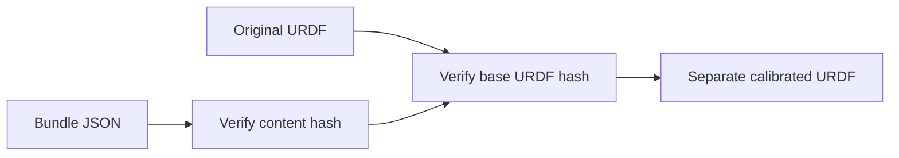

# Using the selected calibration bundle

The bundle is a portable description of the selected August 12 calibration.
It records camera and target transforms, seven joint-position offsets, input
identities and fit diagnostics. Loading it does not fit another model or contact
the robot.



| Operation | Code |
| --- | --- |
| Validate fields and content hash | `CalibrationBundle.load` / `from_dict` in [`calibration_bundle.py`](../src/g1_aprilcube_calibration/calibration_bundle.py) |
| Apply the camera and joint offsets | `CalibrationBundle.materialize_urdf` in the same file |
| Expose read-only inspection and optional export | `inspect-calibration-bundle` in [`workflow_cli.py`](../src/g1_aprilcube_calibration/workflow_cli.py) |
| Check equivalence, tampering and preservation of the base model | [`test_calibration_bundle.py`](../tests/test_calibration_bundle.py) |

## Inspect without exporting

From the repository root:

```bash
.venv/bin/g1-calib inspect-calibration-bundle \
  --calibration-bundle config/calibrations/dex3_shared_20260812_selected_free.json \
  --urdf config/urdf/g1_29dof_rev_1_0_g1pilot_collision.urdf
```

The command reports the bundle identity, transforms, offsets and validation
record. Add `--output-urdf work/calibrated.urdf` to write an overlay. The output
must differ from the base URDF, and the base file must match the bundle hash.
Relative mesh paths are rebased for the output location. Keep the Unitree model
checkout available when loading meshes.

Joint offsets are incorporated into the copied model's joint origins. Continue
to provide measured encoder positions to that model; adding the offsets to the
positions as well would apply them twice. This command does not change a robot
controller's active model.

## Interpreting the evidence

The selected fit used 41 left and 62 right observations. The paths in
`provenance.datasets` identify those original inputs and retain their content
hashes. **They are not required to inspect or materialize this bundle.** Raw
sessions and analysis outputs remain separate local evidence.

The bundle's validation status remains
`analysis_candidate_not_physical_task_validation`, preserving what was recorded
when it was created. The August 25 stacking baseline subsequently used this
bundle. A successful demonstration does not establish absolute calibration
accuracy across the workspace or on a different installation.

The camera/head configuration must match the calibration. Fitted target
transforms are effective registrations for that model; the physical wrist CAD
remains the reference for visibility and occlusion. The later V7 torso fixture
does not replace this bundle and has not produced a qualified replacement
calibration.
