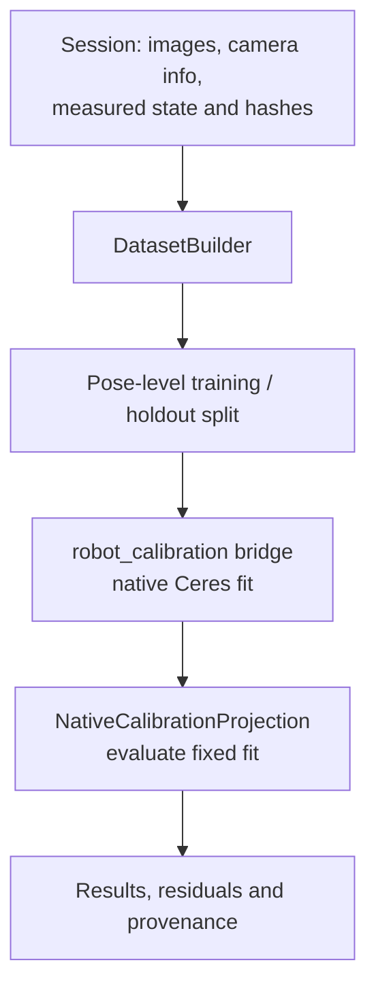

# Calibration implementation entry points

This reference locates the retained calibration pipeline. Start with the
[research guide's workflow](https://sri299792458.github.io/g1-research-docs/calibration/workflow.html)
and [results](https://sri299792458.github.io/g1-research-docs/calibration/results.html)
for the lessons from physical collection and model evaluation. The later
tabletop bilateral workflow is a separate implementation.



| Responsibility | Source |
| --- | --- |
| CLI parser and command dispatch | [`cli.py`](../src/g1_aprilcube_calibration/cli.py), [`workflow_cli.py`](../src/g1_aprilcube_calibration/workflow_cli.py) |
| Capture ownership and hardware entry points | [`hardware_cli.py`](../src/g1_aprilcube_calibration/hardware_cli.py) |
| Retained session and image/state pairing | [`session_store.py`](../src/g1_aprilcube_calibration/session_store.py), [`timestamp_pairing.py`](../src/g1_aprilcube_calibration/timestamp_pairing.py) |
| Rebuild and split observations | [`dataset_builder.py`](../src/g1_aprilcube_calibration/dataset_builder.py) |
| Native optimizer adapter | [`robot_calibration_bridge.py`](../src/g1_aprilcube_calibration/robot_calibration_bridge.py) |
| Evaluate native results and export residuals | [`calibration_evaluation.py`](../src/g1_aprilcube_calibration/calibration_evaluation.py), [`residual_report.py`](../src/g1_aprilcube_calibration/residual_report.py) |
| Compare bilateral models offline | [`analyze_dual_arm_native.py`](../tools/analyze_dual_arm_native.py), [`analyze_native_joint_subsets.py`](../tools/analyze_native_joint_subsets.py) |
| Study dataset size and residual structure | [`analyze_native_learning_curve.py`](../tools/analyze_native_learning_curve.py), [`analyze_residual_predictability.py`](../tools/analyze_residual_predictability.py), [`analyze_calibration_diagnostics.py`](../tools/analyze_calibration_diagnostics.py) |

## Offline command discovery

After setup, these commands display interfaces without collecting data or
invoking a fit:

```bash
.venv/bin/g1-calib --help
.venv/bin/g1-calib build-dataset --help
.venv/bin/g1-calib solve --help
.venv/bin/python tools/analyze_dual_arm_native.py --help
```

`build-dataset` consumes a retained session, verifies the recorded artifacts and
pairing, and writes a derived dataset. An unfinished session requires explicit
`--allow-unfinalized`; that flag does not certify successful session cleanup.
The clean source tree does not include the raw sessions.

`solve` uses the pinned Mike Ferguson `robot_calibration` Ceres backend. The
Python projection/evaluation code does not provide a second optimizer. The
native runner and dependencies are recorded in
[`config/upstream_pins.yaml`](../config/upstream_pins.yaml) and
[`tools/install_robot_calibration_local.sh`](../tools/install_robot_calibration_local.sh).
Installing or rebuilding that runtime is separate from reading this code.

The fixed-target and free-target hypotheses answer different questions. A free
registration can absorb kinematic error; a small training residual alone does
not establish the physical camera pose. Keep pose-level holdout results, side
identity, marker geometry and the fitted model together.

## Hardware boundary

The right default pairs `hardware_dex3_aruco.yaml` with
`dex3_dorsal_aruco_target.json` (ID 4). The left pairs
`hardware_dex3_left_aruco_id5.yaml` with
`dex3_left_dorsal_aruco_id5_target.json` (ID 5). Hardware, target and collision
profiles are under `config/` and must match the actual installation.

Hardware wrappers require the commissioned PC2 watchdog, the correct ROS/SDK
environment, camera profile and Ethernet interface. They can acquire ownership
and move the robot. Fixture inspection, offline tests and repository
consolidation do not authorize those actions. For the distinct motion service,
FSM and machine-layout meanings, read the retained
[control and recovery evidence](g1_control_state_and_recovery.md).
