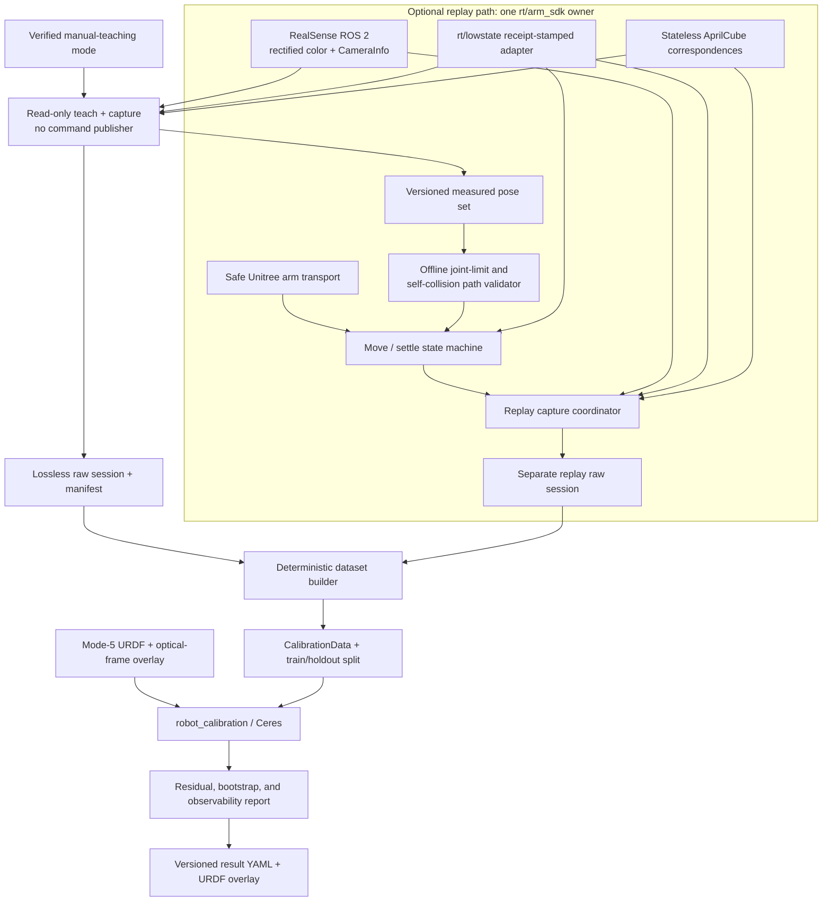
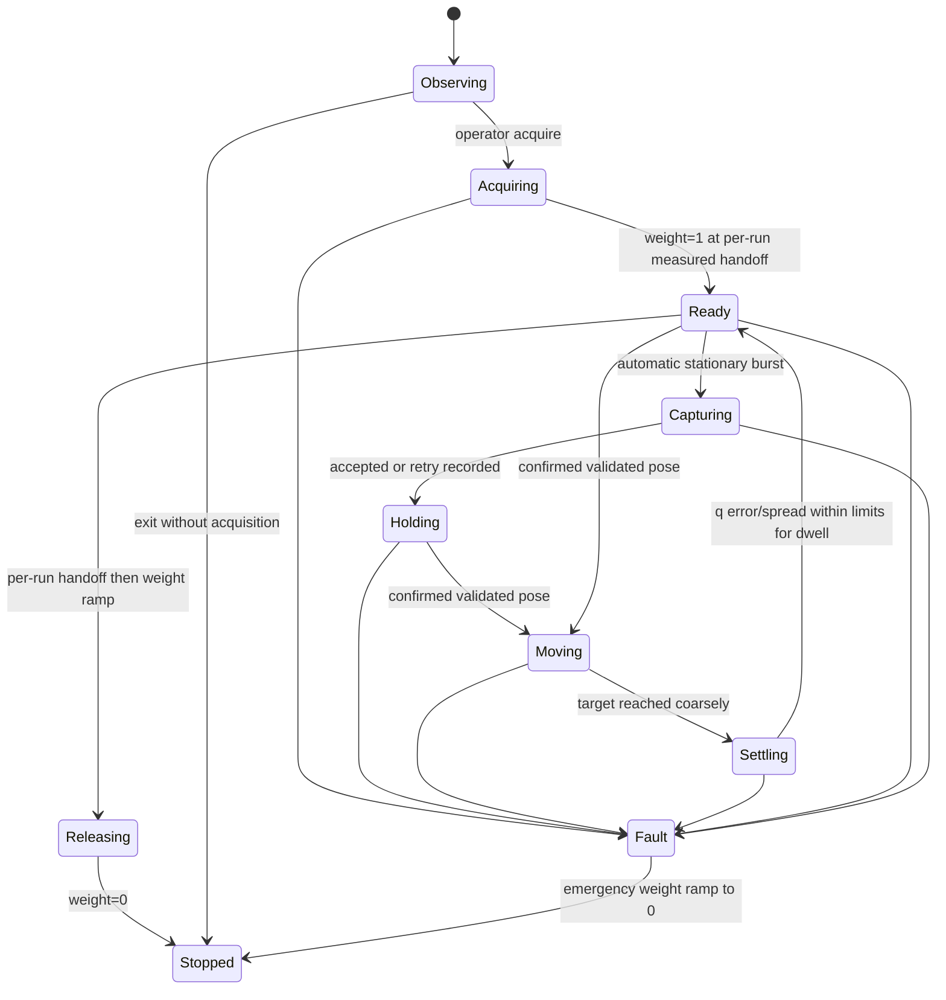

# G1 RealSense–AprilCube Calibration: Detailed Implementation Plan

> **Carrier-side update (2026-08-03):** The implementation is arm-generic.
> `calibration_arm` selects the moving joints and hand link; the opposite arm is
> frozen and monitored. The current physical setup selects `left`, so joints
> 15–21 move, joints 22–28 are held, and the carrier is `left_rubber_hand`.

## 1. Outcome and scope

The first useful deliverable is a repeatable, offline-verifiable estimate of the
transform from `torso_link` to the RealSense **color optical frame** on the
mode-5 Unitree G1. The estimate will be conditioned on the stock G1 arm
kinematics. It will be produced from raw AprilCube image corners and synchronized
G1 joint states, with the unknown dummy-hand-to-cube transform estimated at the
same time.

This distinction matters: without MOCAP or another independently registered
reference, the first result is not proof of an absolute camera pose. It is the
camera extrinsic that best agrees with the nominal G1 kinematic model over the
sampled workspace. Held-out residuals and repeated solutions can establish
internal consistency; a torso-registered target is still required to quantify
how much G1 FK error has been absorbed into the result.

For the first experiment:

- use `unitree_ros/robots/g1_description/g1_29dof_rev_1_0.urdf`;
- use `torso_link` as the common robot frame;
- use the rigid `left_rubber_hand` link as the configured target carrier;
- use the existing rounded 40 x 40 x 40 mm `dex3_safe_cube` with six 30 mm
  `4x4_100` markers;
- attach it with the Scotch foam mounting tape already purchased;
- physically fix and witness-mark the manual camera/head pitch;
- manually guide the left arm through useful camera-visible configurations and
  record the complete measured seven-joint arm vector from `rt/lowstate` while
  capturing the synchronized calibration image burst; and
- retain replay through one exclusive `rt/arm_sdk` owner as an optional path
  for repeatability experiments and future camera configurations, not as a
  prerequisite for the first calibration dataset.

Wrist positions may vary naturally between recorded poses. They are measured and
included in FK, so this does not require inverse kinematics and is not a
calibration-model problem. Mechanical target rigidity must instead be verified
over the recorded orientation range with repeated full-joint anchor poses.

## 2. Repository audit and disposition

The review is pinned to these revisions:

| Repository | Revision | What it contributes | What it does not provide |
|---|---|---|---|
| `mikeferguson/robot_calibration` (`ros2`) | `db991b040d1dc28af09d8865fc72f09720e12b73` | ROS 2 calibration messages, URDF/KDL projection, configurable free joint/frame parameters, Ceres batch optimization, and the required 3D-chain-to-2D-camera residual | AprilCube detection, distorted-image projection, robust loss, final per-corner residual export, covariance/observability analysis, or image-time joint synchronization |
| `sri299792458/aprilcube` (`main`) | `80ed7c72ed00aef6dc70f77d8169a199e9a612cd` | Generated target geometry, tag-to-3D-corner mapping, tuned OpenCV marker detection, sub-pixel corners, PnP diagnostics, synthetic rendering tests, the exact config for the printed cube, and the new public stateless correspondence API | ROS interfaces or G1-specific capture policy |
| `TRI-ML/raiden` (`main`) | `2353b1040c8ffb67158fc7059a8ed61b4c4e672e` | A useful RealSense wrapper, factory-intrinsics extraction, hardware-clock caveats, bag playback, calibration result schema, Rerun visualization patterns, and examples of stationary capture | G1 support; its calibration runner is tied to 6-DoF YAM arms, CAN controllers, and a fixed ChArUco board |

`unitreerobotics/unitree_ros` is a model/interface reference, not one of the
three integration dependencies. It confirms that mode 5 maps to the revision-1.0
29-DoF model and that the selected left-arm chain is:

```text
torso_link
  -> left_shoulder_pitch_joint
  -> left_shoulder_roll_joint
  -> left_shoulder_yaw_joint
  -> left_elbow_joint
  -> left_wrist_roll_joint
  -> left_wrist_pitch_joint
  -> left_wrist_yaw_joint
  -> left_hand_palm_joint (fixed)
  -> left_rubber_hand
```

The same URDF contains nominal `torso_link -> d435_joint -> d435_link` geometry.
It does not define the RealSense color optical frame, so the calibration overlay
must append the actual driver-reported optical-frame chain.

The official `g1_29dof_lock_waist_rev_1_0.urdf` is otherwise byte-for-byte
equivalent in model content except for four attributes: the robot name;
`waist_roll_joint` and `waist_pitch_joint` change from `revolute` to `fixed`;
and the non-standard `dont_collapse="true"` attribute is removed from the two
fixed hand-palm joints. Waist yaw remains revolute. All link/joint names,
origins, arm/camera transforms, limits, inertials, and visual/collision geometry
are identical. Therefore both produce the same `torso_link ->
left_rubber_hand` calibration FK, but use the full 29-DoF URDF for this project
so measured waist roll/pitch remain representable and whole-body collision/TF
checks do not silently assume they are zero.

### G1 control/replay findings

The control design is based on a separate audit of the official Unitree and
community implementations:

- Unitree's `unitree_ros2` G1 arm example contains a hard-coded `MoveTo`
  helper that publishes `/arm_sdk`, reads `/lowstate`, interpolates at 50 Hz,
  clamps each joint to 0.5 rad/s, and ramps out the blend weight. It proves the
  intended mechanism but is not a reusable arbitrary-goal service.
- Unitree's Apache-2.0 `xr_teleoperate` repository contains
  `G1_29_ArmController`, which reads `rt/lowstate`, publishes `rt/arm_sdk` at
  250 Hz, and clips targets relative to measured arm positions.
- Unitree's `unitree_lerobot` replays recorded G1 dataset frames through that
  controller. This proves that joint record/replay is an official supported
  pattern, although its dense episode loop does not provide the required
  move-settle-capture protocol.
- No official Unitree G1 repository exposes arbitrary arm goals through ROS 2
  `control_msgs/action/FollowJointTrajectory`. The standard ROS 2 trajectory
  controller would require a G1 `ros2_control` hardware interface that Unitree
  does not publish.
- G1Pilot's checked-out `dev` arm controller consumes Cartesian hand poses and
  runs OpenSoT IK plus optional FCL collision avoidance. It has no discrete
  joint-vector replay interface and is not part of the calibration runtime.

Do not instantiate the official `G1_29_ArmController` unchanged on hardware.
Its motion-mode constructor starts a publisher thread with an all-zero target
and blend weight one before a caller can safely seed the target, and it provides
no explicit thread shutdown. Instead, implement a small Apache-attributed
derivative of its G1-only transport semantics with these corrections:

1. receive a fresh mode-5 `LowState` before creating any active command;
2. seed both-arm targets from the measured state;
3. begin with blend weight zero and ramp up only under explicit operator
   acquisition;
4. expose stop events, joined threads, clean release, and emergency release;
5. reject stale state, wrong machine mode, invalid motor counts, and non-finite
   commands; and
6. retain a source revision and attribution notice so future upstream changes
   can be audited.

G1Pilot remains an optional development-time validator. Its mode-5 collision
geometry and selected collision pairs can seed a standalone path checker, but
the hardware executor must not import or launch G1Pilot and both programs must
never publish `rt/arm_sdk` simultaneously.

### `robot_calibration` findings

The reusable path is `Chain3dModel -> Chain3dToCamera2d -> Camera2dModel`:

1. `Chain3dModel` transforms target-frame 3D points through the G1 FK tree.
2. A free frame whose name matches the point `frame_id` represents the unknown
   `left_rubber_hand -> aprilcube_target` transform.
3. A free correction on `d435_joint` represents the unknown camera-mount
   correction.
4. `Camera2dModel` projects the resulting points into the camera and subtracts
   observed pixel coordinates.

Important constraints discovered in the code:

- `Camera2dModel` uses only `CameraInfo.p` (`fx`, `fy`, `cx`, `cy`) and ignores
  distortion. The MVP must therefore use a rectified color image with matching
  `CameraInfo`, or explicitly rectify frames before creating observations.
- Every sample is a single Ceres residual block with plain squared loss. One bad
  tag can affect an entire solve; outlier diagnostics and a two-pass fit are
  mandatory.
- The current exporter writes timestamped files under `/tmp` and only exports
  intrinsics for `Camera3dModel`. The calibrated URDF/YAML must be copied into a
  versioned run directory by our wrapper.
- The optimizer prints initial residuals but has no structured final per-corner
  report or Jacobian conditioning report.
- The built-in `CaptureManager` obtains the latest `JointState` after feature
  capture rather than the state nearest the image timestamp. Quasi-static
  capture makes this less dangerous, but the new recorder should still pair by
  timestamp.
- `ChainManager` subscribes to `/joint_states`, assumes valid velocity arrays,
  and has no Unitree low-level-state adapter.
- A missing joint name silently becomes position zero inside the kinematic
  model. The recorder must reject incomplete joint states before saving them.
- The MVP keeps every arm-joint offset fixed. Pose variation, including wrist
  variation, does not by itself justify adding joint-offset parameters before
  residual and observability analysis.

The ROS message schema is already sufficient for the MVP. Each calibration
sample can contain one camera observation and one hand-chain observation with
identically ordered points. There is no tag-ID or per-corner uncertainty field,
so raw source images and detection metadata will also be retained in the bag.

### `aprilcube` findings

The exact config for the printed physical target is
`models/dex3_safe_cube/config.json`:

- outer dimensions: 40 x 40 x 40 mm;
- tangent edge/corner radius: 3 mm, outside the planar marker regions;
- marker width: 30 mm;
- dictionary: OpenCV ArUco `4x4_100`;
- tag IDs: 0 through 5, assigned to `+X`, `-X`, `+Y`, `-Y`, `+Z`, `-Z`;
- target origin: cube center; and
- corner order: top-left, top-right, bottom-right, bottom-left as viewed from
  outside each face, matching OpenCV ArUco output.

The earlier sharp `models/1x1x1_30_cube` model has the same dimensions, marker
planes, IDs, and corner coordinates, but it is not the artifact recorded as the
completed physical print. Use the rounded target's own config for unambiguous
provenance.

`build_tag_corner_map()` provides the required 4 x 3 object points per tag in
**millimetres**. The bridge must convert these values to metres before passing
them to `robot_calibration`.

`CubePoseEstimator.process_frame()` is deliberately more sophisticated than a
calibration measurement source. It can use a prior pose, recover rejected quads,
track corners with optical flow, emit predicted poses, apply temporal gates, and
filter pose through a Kalman filter. Those features are valuable for live
tracking but must not create calibration observations. The calibration path will
use only current-frame decoded tags and their sub-pixel corners. PnP remains a
diagnostic and initialization aid, not the quantity minimized by the final
optimizer.

Offline verification completed during this review:

- generator and web tests: 14/14 passed; and
- rounded physical-target synthetic detection: 48/48 viewpoints detected and
  passed the repository thresholds with temporal filtering disabled.

These synthetic tests validate ordering and software geometry, not print or
camera accuracy.

### `raiden` findings

Raiden supports two arrangements built around a fixed ChArUco board:

- a moving wrist camera on a YAM gripper via `cv2.calibrateHandEye`; and
- a fixed scene camera whose pose is averaged relative to a fixed board.

Our arrangement is different: the camera is fixed to the G1 torso, the target is
attached to the moving hand, and both the camera mount and target mount are
unknown. This is a simultaneous robot-world/hand-eye problem. Raiden's solver
must not be called unchanged.

The reusable pieces are narrower:

- its `RealSenseCamera` documents and exposes the color intrinsics and
  Brown-Conrady coefficients from the device;
- it records color/depth to a RealSense bag and can play it back without dropping
  every other frame;
- it documents inconsistent RealSense global timestamps and records a measured
  hardware-to-wall-clock offset; and
- its result JSON and Rerun visualizer are useful design references.

Raiden will not be a runtime dependency of the first ROS prototype. Its package
requires Python 3.11, YAM/i2rt, heavy learning dependencies, and a private-SSH
dependency. The ROS RealSense driver should own the camera during calibration;
Raiden and the ROS driver cannot safely open the same device concurrently.
Raiden's standalone RealSense path remains a fallback for offline bench capture.

## 3. Measurement model

Use the notation `A_T_B` for a transform that maps points from B into A.

For capture `i` and cube corner `j`:

```text
predicted pixel = project(
    K_rect,
    inverse(torso_T_color_optical)
      * torso_T_left_rubber_hand(q_i)
      * left_rubber_hand_T_aprilcube
      * aprilcube_p_j
)
```

The first solve contains 12 free parameters:

- six for the correction to `d435_joint`; and
- six for `left_rubber_hand_T_aprilcube`.

Rectified color intrinsics and all G1 joint parameters remain fixed. All seven
left-arm positions, including the three wrists, are measured for every capture
and included in FK. They may vary between recorded configurations.

The two unknown rigid transforms are identifiable only when the arm motion
contains rotations about multiple axes and translations/depth changes. Repeating
many nearly identical front-facing poses does not add the missing information.

## 4. Proposed software architecture



Create one small ROS 2 Python package in the parent project. Keep pure logic
free of ROS and Unitree imports so it can run under ordinary `pytest`; adapters
sit at the edges.

```text
g1_aprilcube_calibration/
  package.xml
  setup.py
  resource/g1_aprilcube_calibration
  g1_aprilcube_calibration/
    models.py
    joint_map.py
    pose_schema.py
    pose_store.py
    motion_profile.py
    safety.py
    executor_state_machine.py
    timestamp_pairing.py
    operator_preview.py
    transports/
      base.py
      fake.py
      unitree_arm_sdk.py
    ros/
      lowstate_adapter.py
      camera_buffer.py
      session_runner.py
    pose_recorder.py
    correspondence.py
    pose_validator.py
    dataset_builder.py
    dataset_split.py
    bootstrap.py
    solver_runner.py
    residual_report.py
    export_run.py
  config/
    robot_mode5.yaml
    motion_defaults.yaml
    target_dex3_safe_cube.yaml
    capture_quality.yaml
    optimizer_extrinsics_only.yaml
    capture_poses.yaml
    collision_pairs.yaml
  schemas/
    pose_set.schema.json
    session_manifest.schema.json
    result.schema.json
  launch/
    preview.launch.py
    run_session.launch.py
    solve.launch.py
  urdf/
    g1_mode5_calibration.urdf.xacro
  test/
    unit/
    integration/
    synthetic/
    test_corner_contract.py
    test_executor_state_machine.py
    test_timestamp_pairing.py
    test_synthetic_recovery.py
```

The first command-line surface is deliberately small:

```text
g1-calib inspect-hardware       # read only; topics, mode, motor mapping
g1-calib teach-poses           # manual pose, measured arm_sdk hold, synchronized data
g1-calib validate-poses        # offline joint/path/collision report
g1-calib collect-session       # optional rt/arm_sdk replay + capture
g1-calib build-dataset         # raw session -> CalibrationData
g1-calib solve                 # train solve, holdout evaluation, export
g1-calib report                # regenerate diagnostics without re-solving
```

Avoid custom ROS actions/services in the MVP. `teach-poses` owns the camera,
state, measured-pose hold, and capture lifecycle in one process. It reuses the
commissioned control state machine and never sends a pose different from the
stationary measured handoff. The optional `collect-session` command uses the
same transport for validated replay. A standard trajectory-action adapter can
replace only `transports/unitree_arm_sdk.py` later.

### 4.1 Unitree transport boundary

`ArmTransport` is an internal protocol with no calibration knowledge:

```python
class ArmTransport(Protocol):
    def observe(self) -> ArmState: ...
    def acquire(self) -> None: ...
    def set_dual_arm_target(self, q14: ArrayLike) -> None: ...
    def release(self, emergency: bool = False) -> None: ...
    def close(self) -> None: ...
```

The hardware implementation is a minimal G1-only derivative of Unitree's
Apache-2.0 controller. It uses `unitree_sdk2py` messages and CRC, but changes
initialization and lifecycle as described above. It must be dependency-injected
with publisher/subscriber and clock interfaces so nearly all behavior is tested
without DDS.

Only the transport thread publishes `rt/arm_sdk`. The session runner and
capture code communicate with it through thread-safe targets/state snapshots.
A project-local process lock prevents two copies of this executor. Since that
cannot detect unrelated Unitree/G1Pilot programs, startup also presents an
operator checklist and refuses unattended acquisition.

### 4.2 Motion/executor state machine



Transitions are explicit and logged. Capture is impossible in `Moving`; motion
is impossible while `Capturing`. Before publisher creation, a subscriber-only
preflight selects a stationary measured handoff and validates the exact entry
and return routes. Clean release returns to that run's handoff and then ramps
the blend weight to zero.
Emergency release skips the handoff motion and ramps weight out immediately; the onboard controller may
then move the arms toward its own command, so the operator must keep the area
clear.

Initial hardware-commissioning values are conservative and configurable:

- command rate: 250 Hz;
- maximum joint speed: 0.2 rad/s;
- coarse position arrival: 0.05 rad;
- target position error: 0.05 rad, matching Unitree's G1 home-arrival check;
- activation and held-arm position error: 0.02 rad;
- settled measured-position spread: 0.01 rad;
- continuous dwell: 0.5 s, matching the pose-recording stationarity window; and
- `LowState` freshness timeout: 0.1 s.

These are starting values, not claimed G1 performance. Hardware commissioning
must measure tracking and set final thresholds without silently relaxing them
during a collection run.

### 4.3 Safety invariants

The executor rejects or faults unless all relevant invariants hold:

| Invariant | Enforcement |
|---|---|
| Robot is the mode-5 29-DoF G1 | check every `LowState.mode_machine`, motor count, and mapping |
| No command before fresh state | transport starts read-only and seeds targets from measured q |
| One intended command owner | process lock, operator checklist, never launch G1Pilot/XR teleop concurrently |
| Targets are valid | exact 7/14 length, finite values, URDF soft limits with margin |
| Transition is prevalidated | pose-set manifest contains validator version/hash and path result |
| Per-cycle command is bounded | velocity clamp independent of target or UI behavior |
| State remains fresh | stale state triggers fault and emergency blend ramp |
| Left arm is deterministic | capture its measured safe pose at acquisition and hold it for the session |
| Operator controls each move | one confirmation per pose; no autonomous multi-pose run on first hardware version |
| Capture is stationary | measured q-spread dwell gate, not a fixed sleep; raw `dq` is diagnostic only |
| Shutdown is explicit | signal handlers, joined threads, terminal weight-zero publish, outcome logged |

### 4.4 Laptop preview and pose-quality guidance

Both manual pose authoring and replay capture require a live laptop preview.
The preview subscribes to the rectified color image, its matching `CameraInfo`,
and receipt-stamped `LowState`/`JointState`. It draws the detected tag outlines,
IDs and sub-pixel corners, plus a diagnostic cube axis when PnP is valid. A side
panel reports image/state age, measured `dq`, settle dwell, visible faces,
shortest tag side, image-boundary margin, multi-face PnP reprojection error, and
coverage relative to all previously saved poses.

The live detector is the stateless current-frame calibration detector. It must
not use optical-flow corners, a Kalman prediction, rejected-quad recovery, or a
previous frame to turn a current failure into a displayed success.

Use three operator states, with the exact thresholds configurable and tuned
after the stationary camera test:

| State | Meaning |
|---|---|
| Red / save disabled | wrong robot mode; stale/incomplete state or camera data; arm not settled; no valid tag; duplicate ID; clipped/out-of-image corner; tag below the 25 px hard size floor; or another hard data-contract failure |
| Yellow / explicit override | technically recordable but weak: only one visible face, tag below the preferred 40 px size, small boundary margin, questionable multi-face PnP consistency, or a view redundant with the saved set |
| Green / recommended | every hard gate passes, the cube is comfortably inside the image, preferably two adjacent faces are visible, and the view fills a missing image/depth/orientation coverage region |

Green describes calibration information quality, not motion safety. A manually
recorded configuration is only a candidate until offline joint-limit,
self-collision, path, and operator-clearance validation passes. The preview must
show these as separate statuses rather than implying that detector success
authorizes replay.

`teach-poses` uses the preview while the operator manually teaches the arm.
The first `S` seeds a zero-displacement `arm_sdk` handoff from the stationary
measured state and ramps ownership; the second `S` records a seven-frame
stationary lossless burst. `R` returns weight to zero before the next manual
pose. Every image retains its centered complete 29-joint `q`, `dq`, and
`tau_est` window, exact `CameraInfo`, receipt/header timestamps, pairing,
detection, quality report, and hashes. The capture also retains the
operator-supported pre-acquisition state. One medoid frame becomes the derived
calibration sample. Yellow requires a recorded override reason; red cannot be
saved. Undo removes the active pose through the pose-store API and marks the
corresponding raw capture rejected rather than deleting evidence.

`collect-session` shows the same preview during optional replay. After a
validated target is reached and the measured dwell gate passes, it records a
short stationary burst.
The best/median correspondence becomes one calibration sample for that pose;
all raw frames remain stored. A red result is rejected and retried or skipped,
never silently counted. This prevents a long dwell or repeated frames at one
pose from receiving extra optimizer weight.

Keep repository responsibilities clean:

- keep the public stateless correspondence API and its geometry tests in
  `aprilcube`;
- add structured residual/Jacobian reporting to `robot_calibration` only after
  the basic synthetic solve works; and
- place G1-specific orchestration in the new package, not in either upstream.

## 5. Data contract

Use two data layers. The **raw session is immutable** and contains enough data
to rerun detection and pairing. `CalibrationData` is a deterministic derived
artifact, never the only copy of a measurement.

### 5.1 Recorded pose set

`capture_poses.yaml` is versioned and schema-validated:

```yaml
schema_version: 3
robot:
  model: g1_29dof_rev_1_0
  mode_machine: 5
  urdf_sha256: "..."
joint_order:
  - left_shoulder_pitch_joint
  - left_shoulder_roll_joint
  - left_shoulder_yaw_joint
  - left_elbow_joint
  - left_wrist_roll_joint
  - left_wrist_pitch_joint
  - left_wrist_yaw_joint
calibration_arm: left
poses:
  - id: pose_001
    group: near_center
    measured_calibration_q: [0, 0, 0, 0, 0, 0, 0]
    measured_full_q: [/* 29 values */]
    recorded_at_utc: "..."
    source: manual_teaching
    anchor: false
```

The recorder obtains a short stationary state window, rejects excessive
measured-position spread, records raw `dq` only as diagnostic evidence, and
saves the median q plus spread rather than one potentially noisy sample.
Every edit changes the pose-set content hash and invalidates the old transition
validation report. Handoff and held-arm vectors are deliberately not serialized;
optional replay derives them from a stationary measured state immediately before
command ownership.

### 5.2 Raw capture session

Each session directory contains:

```text
sessions/<session_id>/
  raw/images/                  # lossless rectified PNG burst frames
  raw/states/                  # complete state window for every image
  manifest.json               # pose/capture outcomes and all timestamps
  pose_set.yaml               # evolving copy while teaching; immutable at finalize
  hardware.yaml               # resolved non-secret hardware configuration
  target.json                 # measured target geometry and hash
  collision_pairs.yaml        # exact collision geometry policy
  capture_quality.yaml        # exact image/state acceptance policy
  validation_report.json      # replay sessions only: approved transitions
  preview/                    # annotated PNGs, never solver input
```

For each image, store the ROS header stamp and local receipt timestamp. Unitree
`LowState` does not provide a ROS header, so the adapter stamps it on receipt
using the same local ROS clock used by the camera callback. Store the original
camera header separately rather than overwriting it.

The accepted image must be bracketed by fresh joint samples and lie inside a
stationary window. Save the nearest sample, pairing delta, and q/dq min/max over
the window. This makes quasi-static validity stronger than relying on a nominal
20 ms timestamp match alone.

Live AprilCube detection provides operator feedback and an acceptance decision,
but the raw rectified image is authoritative. The offline builder reruns the
same stateless detector and verifies that its ordered correspondence hash
matches the live result.

### 5.3 Derived calibration sample

Each accepted pose produces one `CalibrationData` sample:

```text
joint_states:
  complete mode-5 names, positions, and velocities

observations[head_color]:
  sensor_name: head_color
  features: [u, v, 0] in deterministic (tag_id, corner_index) order
  ext_camera_info: CameraInfo matching the rectified image

observations[left_aprilcube]:
  sensor_name: left_aprilcube
  features: matching [x, y, z] target points in metres
  each feature frame_id: aprilcube_target
```

The derived dataset also stores:

- the exact rectified image used for detection;
- a reference back to the raw session and image record;
- the validated `JointState` nearest the image timestamp;
- detected tag IDs, raw corner coordinates, per-tag quad size/quality, and PnP
  diagnostic error in a sidecar/custom message;
- capture ID, pose-group ID, whether it is an anchor repeat, and rejection reason;
- target config and SHA-256;
- RealSense serial, firmware, stream profile, and frame ID;
- G1 URDF revision and Git SHA; and
- head-pitch witness-mark check; and
- source pose-set, transition-validation, detector, and builder hashes.

Never average unrelated poses. If a short stationary burst is used, retain all
raw frames but produce one median-corner observation per commanded pose so that
slow poses do not receive extra optimizer weight.

### 5.4 Result schema

`result.yaml` names transforms unambiguously and includes units:

```yaml
schema_version: 1
reference_frame: torso_link
camera_frame: <exact CameraInfo.frame_id>
torso_T_camera:
  translation_m: [x, y, z]
  quaternion_xyzw: [x, y, z, w]
left_rubber_hand_T_aprilcube:
  translation_m: [x, y, z]
  quaternion_xyzw: [x, y, z, w]
intrinsics_source: factory_rectified_camera_info
free_parameters: [d435_joint_xyz_rpy, aprilcube_target_xyz_rpy]
validity:
  camera_serial: "..."
  stream_profile: "..."
  head_witness_mark: "..."
```

Never publish a transform from a result whose camera serial, optical frame,
stream profile, robot model, or head witness-mark acknowledgement does not match
the live configuration.

## 6. Implementation phases and gates

### Phase 0 — Scaffold and freeze conventions

Tasks:

1. Scaffold `g1_aprilcube_calibration` as an `ament_python` package with pure
   core modules, the fake transport, schema validation, linting, and pytest.
2. Pin `unitree_sdk2_python` and the exact `xr_teleoperate/robot_arm.py` source
   revision used for the attributed transport derivative. Keep ROS Jazzy on
   system Python; do not mix the Raiden Python 3.11 environment into this
   workspace.
3. Add a reproducible dependency/bootstrap document or script for ROS image
   transport, `cv_bridge`, `image_proc`, `rosbag2_py`, Unitree messages,
   `robot_calibration`, Ceres, gflags, and protobuf.
4. Record the RealSense model, serial, firmware, active color resolution/FPS,
   exact image topic, `CameraInfo` topic, and optical `frame_id`.
5. Confirm whether a rectified color topic exists. If not, configure `image_proc`
   or rectify inside the capture node and emit matching zero-distortion
   `CameraInfo`.
6. Lock the manual head/camera pitch and add two witness marks.
7. Attach the existing cube to the rigid central/proximal palm with the ordered
   Scotch mounting tape. Clean both surfaces and press the full base area firmly.
8. Measure the six printed tag widths and cube dimensions with calipers. Store
   mean and spread. Update the target geometry only if the measured systematic
   scale differs materially from the 30/40 mm design.
9. Verify the robot's manual-teaching/compliant mode on the installed firmware
   and verify read-only `rt/lowstate` acquisition for mode 5 and left-arm motor
   indices 15 through 21. Do not implement compliance by simply zeroing gains.

Gate:

- the package builds and unit tests pass from a clean documented environment;
- all frame names/topics and the target config are recorded;
- the witness marks and cube corner marks are visible and unchanged; and
- the rectified image and `CameraInfo.p` are a verified pair; and
- manual teaching can be entered and exited safely while the recorder receives
  the expected mode-5 joint indices without publishing any command.

### Phase 1 — Calibration-safe AprilCube correspondences

Add a public API that returns decoded current-frame observations without PnP
history, filtering, recovery, or optical flow:

```python
detections = detect_correspondences(image)
# [{tag_id, image_corners_px[4,2], object_corners_mm[4,3], quad_quality}, ...]
```

Requirements:

- sort detections by tag ID;
- preserve the repository's TL/TR/BR/BL ordering;
- reject duplicate IDs and corners outside the image;
- make sub-pixel refinement configurable and enabled for calibration;
- expose rejected candidates only for debugging, never as measurements; and
- provide a stateless mode whose result depends only on the current image.

Tests:

- all six tag IDs map to the exact printed rounded-target 3D corners;
- shuffled detector output produces identical ordered correspondences;
- a rendered known pose produces consistent 2D/3D pairs;
- millimetre-to-metre conversion occurs exactly once in the ROS bridge; and
- one-face, two-face, partial-visibility, duplicate-ID, and no-detection cases.

Gate:

- an exact projected-point geometry round trip is correct to numerical tolerance,
  while rendered-image detection retains the repository's existing thresholds;
  and
- repeated calls on one frame are bitwise/deterministically ordered.

### Phase 2A — Joint mapping, schemas, and read-only pose recording

Implement and test the explicit mode-5 mapping for all 29 motors, with left-arm
indices 15 through 21. If a trustworthy `sensor_msgs/JointState` already exists,
validate it against raw `LowState`; otherwise publish a receipt-stamped adapter
with equal-length name, position, and velocity arrays.

The recorder never creates an `rt/arm_sdk` publisher. When the operator records
a pose, it:

1. verifies `mode_machine == 5` and fresh state;
2. requires the left arm to remain within a measured-position spread threshold
   for a short window;
3. captures a short burst only after every image has a future state bracket;
4. saves median and spread for the seven selected left-arm joints;
5. losslessly saves every image and its complete 29-joint state window;
6. records UTC and monotonic receipt times, `CameraInfo`, pairing, a pose
   ID/group, detections, quality, and preview; and
7. updates the schema-valid pose snapshot and raw-session manifest.

Tests cover wrong mode, short motor arrays, NaN/Inf, joint-order swaps, duplicate
pose IDs, nonstationary recording, and schema migration rejection.

Gate: a read-only hardware session records and reloads at least ten poses and
their raw bursts with the expected indices, can pause/resume/finalize, rebuilds
the dataset deterministically, and never publishes `rt/arm_sdk` or `rt/lowcmd`.

### Phase 2B — Safe transport and blocking move/settle executor

Implement the fake transport first, then the attributed Unitree transport. The
state machine must pass deterministic fake-clock tests for:

- acquisition with current measured positions and weight zero;
- gradual weight ramp with no commanded joint displacement;
- velocity-limited movement;
- measured arrival and continuous settle dwell;
- timeout, wrong mode, stale state, invalid target, and loop overrun faults;
- operator cancellation during every active state;
- clean handoff/release and emergency release; and
- Ctrl-C/SIGTERM thread shutdown.

The executor controls a fourteen-joint target because `rt/arm_sdk` is dual-arm.
It captures a safe measured right-arm pose during acquisition and keeps that
target fixed while replaying only the recorded left-arm seven-vector.

Do not accept arbitrary live joint arrays from a network topic. `collect-session`
loads a content-hashed pose set and a matching validation report, displays the
exact next target, and requires one operator confirmation for each transition.

Hardware commissioning is deliberately incremental:

1. read-only observation;
2. publish weight zero only;
3. ramp weight 0 -> 1 while commanding the current measured q;
4. hold for several seconds and verify no discontinuity;
5. execute one prevalidated small shoulder/elbow displacement at 0.1 rad/s;
6. return to that run's measured activation pose; and
7. ramp weight to zero and confirm command publication stops.

Each step is a separate supervised run with the physical area clear and the
Unitree remote/emergency procedure immediately available. No multi-pose session
is enabled until all seven steps pass and logs are reviewed.

Gate: fake/simulation tests pass, then the supervised single-pose hardware test
finishes with bounded tracking error, fresh state throughout, and a confirmed
terminal weight-zero command.

### Phase 2C — Offline transition validation

`validate-poses` checks both endpoints and every joint-space interpolation
sample. Use a maximum per-sample joint increment, not only a fixed number of
samples. Required checks are:

- finite values and URDF limits with a configurable margin;
- selected arm-versus-torso, arm-versus-leg, and hand-versus-body collisions;
- right-arm hold pose included in every configuration;
- configured maximum path length and estimated duration; and
- explicit neighboring taught-pose transitions; live handoff/entry/return
  transitions are generated from the stationary activation window.

The validation layer may use Pinocchio/hpp-fcl or an offline G1Pilot environment,
but it emits a small implementation-independent JSON report containing the
URDF hash, collision-pair config hash, pose-set hash, sample spacing, minimum
clearance, and pass/fail for every directed edge. MuJoCo is an optional dynamic
sanity check, not a runtime dependency or substitute for operator clearance from
external obstacles.

Gate: `collect-session` refuses a missing, failed, or hash-mismatched validation
report, and deliberately colliding synthetic poses are rejected in tests.

### Phase 2D — Stationary capture and immutable session recording

Both the measured-pose-hold teacher and optional replay runner maintain bounded
ring buffers for rectified images, `CameraInfo`, measured joint states, and both
header/receipt timestamps. The teacher captures on the second `S`, after
ownership reaches weight one; the replay runner captures after the executor
reaches `Ready`. Each burst:

1. requires fresh joint samples bracketing every candidate image;
2. verifies measured q spread remains within the configured window for the
   entire burst and records raw `dq` and `tau_est` as diagnostic evidence;
3. verifies camera serial/profile/frame and `CameraInfo` are unchanged;
4. runs the stateless detector for live quality feedback;
5. requires adequate corner size, image margin, and no duplicate tag IDs;
6. writes raw topics first, then atomically appends the manifest record; and
7. records accepted, rejected, retry, skipped, and aborted outcomes explicitly.

Initial visual gates, to tune from stationary measurements:

- each accepted tag at least 25 px on its shortest side;
- every corner at least 5 px from the image boundary;
- at least one decoded tag, with two visible faces preferred for dataset design;
- no duplicate IDs; and
- exposure/focus metadata stable when the driver exposes it.

Gate: a fake-robot/synthetic-camera 10-pose run can be interrupted and resumed,
then rebuilt deterministically with no missing raw records, mismatched point
counts, or changed correspondence hashes.

### Phase 3 — Synthetic end-to-end recovery

Before using the robot, generate a synthetic `CalibrationData` bag from the mode-5
URDF with known perturbations to `d435_joint` and the target mount.

Test cases:

1. noiseless, all 12 parameters;
2. 0.2/0.5/1.0 px Gaussian corner noise;
3. partial tag visibility;
4. poor pose diversity to confirm the conditioning alarm;
5. 5% gross outlier corners to exercise rejection; and
6. deliberately incomplete joint state to confirm hard failure.

Gate:

- noiseless recovery reaches numerical tolerance;
- noisy recovery remains unbiased over repeated seeds;
- the poor-diversity dataset is rejected by the conditioning/stability checks;
  and
- train/holdout splitting is by pose ID, never by individual corner.

### Phase 4 — Physical target and stationary-noise qualification

The tape has far more bulk holding strength than needed for a 40 g cube. The
calibration question is whether the target-to-hand transform stays constant, not
whether the cube falls off.

Perform these checks over the wrist orientations present in the recorded pose
set:

1. Hold one safe arm pose and capture 200 frames after exposure stabilizes.
2. Report per-corner pixel standard deviation, tag-ID dropout, PnP translation
   and rotation scatter, and correlation with auto-exposure changes.
3. Replay five recorded full-arm poses and return to the exact same full-arm
   anchor vector after each excursion.
4. Compare the repeated anchor images/corners to the original anchor using the
   recorded joints. This tests the complete head/cube/tape setup for drift.
5. Repeat once after 15 minutes to expose short-term foam creep.

Gate:

- no witness-mark movement;
- anchor residual change is no more than twice stationary detector scatter and
  shows no monotonic drift; and
- detection succeeds over enough of the intended workspace.

If this gate fails, first improve surface preparation and target placement. Move
to the printed keyed clamshell only if measured drift persists. Do not buy a
different tape pre-emptively.

### Phase 5 — Pose-set design and data collection

Collect 60–80 quasi-static arm configurations. A useful starting distribution is:

| Pose group | Count | Purpose |
|---|---:|---|
| image center at near/mid/far depth | 15 | translation and scale/depth leverage |
| left/right/top/bottom image regions | 20 | principal-point/radial residual diagnosis |
| full seven-joint orientation diversity | 15 | multi-axis rotational excitation |
| oblique cube views with two visible faces | 10 | non-coplanar corner geometry |
| repeated anchor configurations | 8–12 | drift and repeatability |

Operational rules:

- the robot remains standing still; waist and legs are not part of this solve;
- move slowly, settle, then capture;
- replay the complete recorded seven-joint vector, including wrist joints;
- capture measured joints at the image timestamp rather than treating the
  recorded or commanded target as the achieved state;
- require a passing hash-matched geometric path-validation report for every
  transition and avoid self-collision, camera-collision, environmental
  obstacles, and joint-limit poses; use MuJoCo selectively when dynamics are in
  question;
- do not chase frame count at the expense of pose diversity;
- keep the cube between roughly 25% and 85% of image width/height; and
- record failed detections and rejection reasons instead of silently skipping
  them.

Assign complete pose groups to an 80/20 train/holdout split before optimization.
Anchor repeats at the same nominal configuration must remain together when used
to measure drift, but at least one independent anchor group should be held out.

Gate:

- at least 50 accepted, geometrically diverse training poses;
- at least 12 held-out poses covering depth and image region;
- no time trend in anchor residuals; and
- pose-diversity/conditioning report passes.

### Phase 6 — Extrinsics-only solve

Build a calibration URDF from the mode-5 file:

- keep `torso_link` as the KDL root;
- keep the configured `left_rubber_hand` as the target-chain tip;
- preserve nominal `d435_joint` as the camera-mount initial value;
- append the fixed RealSense base/color optical transform for the physical
  device and make the camera model tip the exact `CameraInfo.frame_id`; and
- free all six correction components of `d435_joint` plus all six components of
  `aprilcube_target`.

Bootstrap the target transform from several PnP poses composed with nominal FK
and the nominal camera transform. Use a robust translation median and a rotation
mean only as an optimizer starting value.

Solve procedure:

1. fit the 12 parameters on training poses;
2. export raw residuals before and after fitting;
3. flag whole captures with gross median/max corner residuals using a robust MAD
   threshold;
4. inspect every flagged source image;
5. remove only objectively bad detections or synchronization failures;
6. refit once; and
7. evaluate the untouched held-out set.

Run at least five initializations and several pose-subset bootstraps. Equivalent
final transforms and residuals are evidence of a stable basin; materially
different transforms with similar costs indicate weak observability.

Gate targets for the first prototype, subject to measured detector noise:

- held-out median corner error <= 1.0 px;
- held-out p90 <= 2.0 px;
- no structured residual vector field across the image;
- no residual trend with depth, shoulder/elbow angle, time, or tag face;
- subset solutions agree within 3 mm and 0.5 degrees; and
- Jacobian/parameter report contains no near-null direction involving camera
  extrinsics.

These are engineering gates, not a claim of absolute pose accuracy.

### Phase 7 — Residual and observability tooling

Extend `robot_calibration` or add a companion evaluator that emits one record per
corner:

```text
capture_id, pose_group, split, tag_id, corner_index,
observed_u, observed_v, predicted_u, predicted_v,
du, dv, norm_px, image_radius, target_depth,
shoulder/elbow/wrist positions, timestamp
```

Generate:

- RMS, median, p90, p95, and maximum pixel error;
- residual-vector quiver plot over the image;
- error versus image radius and target depth;
- error versus each varied joint;
- per-tag-face error;
- residual and fitted-parameter drift versus capture time;
- repeated-anchor consistency;
- train versus held-out comparison;
- finite-difference Jacobian singular values/condition number; and
- bootstrap parameter distributions and pairwise correlations.

This is the required interpretation of “examine residuals before calibrating
individual joint offsets.” A low overall RMS is insufficient if residuals show a
repeatable joint-angle pattern or if parameters are unstable across subsets.

### Phase 8 — Decide whether any kinematic parameter is justified

Do not free all G1 joint zeros. Consider one additional parameter only when all
of the following hold:

1. the extrinsics-only solution is stable;
2. held-out residuals have a repeatable signed pattern versus one varied joint;
3. that pattern appears in multiple independent pose subsets;
4. the Jacobian shows sensitivity to the proposed parameter that is not nearly
   collinear with the camera or target transforms; and
5. adding the parameter reduces held-out error, not only training error.

Start with one varied shoulder or elbow zero offset and a physically realistic
prior. Re-run all subset, multi-start, and holdout checks. Keep the parameter only
if it improves held-out metrics and remains stable.

Do not add wrist offsets merely because the recorded dataset contains wrist
variation. Begin with every joint offset fixed. A wrist offset may be considered
later, one parameter at a time, only if it satisfies the same held-out residual,
Jacobian independence, subset stability, and physical-prior requirements above;
correlation with `left_rubber_hand_T_aprilcube` must be reported explicitly.

### Phase 9 — Independent validation and deployment

Internal validation cannot fully separate FK bias from camera error. Add one or
more of these checks in increasing order of effort:

1. **Task-level overlay:** project the calibrated hand/cube geometry onto held-out
   color images and inspect contact-relevant locations.
2. **Depth consistency:** compare color-ray/depth observations on a static planar
   target at several distances; this checks the optical-frame and intrinsics
   chain, not robot FK alone.
3. **Second-arm cross-check:** mount or hold a separate target on the left rigid
   hand and solve independently. Agreement is useful but both arms still share
   model bias.
4. **Torso-registered printed fixture:** key a printed target holder to a rigid,
   measurable torso feature. Its transform supplies an FK-independent camera
   check; fixture registration uncertainty must be measured and reported.
5. **Surveyed world target field:** use multiple fixed tags plus a repeatable robot
   base/foot placement fixture for wider-workspace and torso-motion validation.

Deployment artifacts go into a run directory, never directly over the vendor
URDF:

```text
calibration_runs/<timestamp>/
  result.yaml
  calibrated_overlay.urdf.xacro
  target_mount.yaml
  residuals.csv
  report.html
  train_pose_ids.txt
  holdout_pose_ids.txt
  source_bag.txt
  provenance.json
```

`provenance.json` records the camera serial/profile, target measurements, head
witness-mark state, G1 mode, URDF SHA, repository SHAs, parameters freed, and
software command line. The runtime publishes the resulting transform only for
the exact color optical frame and composes factory RealSense transforms to depth
or IMU frames as needed.

The extrinsic is invalidated by a changed head witness mark, loosened camera,
changed RealSense unit/profile/frame chain, or changed torso mounting. Removing
and replacing the cube does not invalidate the camera transform, but the target
mount transform must be solved again before another calibration dataset.

## 7. Verification matrix and development discipline

| Layer | Runs without robot | Required verification |
|---|---:|---|
| Schemas and pose store | yes | round trip, atomic write, corruption, version rejection |
| Joint map and safety limits | yes | all 29 mappings, boundary/margin, NaN/Inf, wrong mode |
| Executor state machine | yes | fake clock/transport for every state, fault, cancel, and shutdown path |
| Unitree command assembly | yes | only arm slots plus weight change; CRC; command-rate and slew properties |
| Collision/path validator | yes | known-free and known-colliding fixtures; hash invalidation |
| AprilCube correspondence API | yes | exact ordering/geometry plus rendered-image regression |
| Timestamp pairing | yes | delayed, reordered, missing, and nonstationary synthetic streams |
| Dataset builder | yes | raw-session replay determinism and source hashes |
| Calibration solve | yes | noiseless/noisy/outlier/degenerate synthetic recovery |
| RealSense capture | camera only | frame/profile consistency and stationary corner noise |
| G1 observation/recording | robot, read only | no command topics, correct mode/index mapping |
| G1 arm acquisition/motion | robot, supervised | seven-step commissioning log and clean release |
| Full collection | robot + camera | anchor drift, diversity, holdout, complete provenance |

No hardware-only code path is accepted without an equivalent fake/simulation
test of its decision logic. Tests do not claim motor safety; they ensure that
the software reaches the intended command or release decision under controlled
inputs.

Keep changes in their owning repositories:

- commit AprilCube API/tests in `aprilcube`;
- commit optimizer changes in `robot_calibration`;
- commit the G1 package, configuration, documentation, and run schemas in the
  parent project; and
- do not modify G1Pilot for this implementation.

Each milestone gets a focused commit after its tests pass. Raw bags, camera
frames, generated reports, and calibration runs stay out of Git; manifests and
small curated synthetic fixtures may be committed. Every run records the Git
status and refuses a deployable result from an undocumented dirty source tree
unless the operator explicitly marks it experimental.

## 8. Risk register

| Risk | Symptom | Mitigation |
|---|---|---|
| G1 FK error absorbed into camera extrinsic | low training error, workspace-dependent held-out bias | pose-held-out residuals, limited joint parameters, torso-registered validation |
| Wrong optical axis/frame | large or mirrored projection error | use exact `CameraInfo.frame_id`; explicit RealSense optical transform test |
| Distorted pixels fed to pinhole model | radial residual pattern | use rectified image and matching `P`, or later add distortion model |
| Image/joint time mismatch | residual grows with recent motion or velocity | stationary dwell, nearest-timestamp state, log pairing delta |
| Tape/cube/head drift | anchor residual changes with time | witness marks, repeated anchor poses, low-speed motion, clamshell only if measured failure |
| Incorrect target scale | depth-dependent translation bias | measure print/tag dimensions and record uncertainty |
| AprilCube inferred corners used as data | unrealistically smooth or history-dependent observations | stateless decoded current-frame corners only |
| Too little motion diversity | different transforms with similar cost | pose-design coverage, multi-start, Jacobian SVD, subset bootstrap |
| Missing/incorrect Unitree joint mapping | discontinuous or nonsensical FK | mode-5 adapter tests and hard rejection of incomplete states |
| One pose over-weighted by frame bursts | fit favors slow/repeated poses | one selected medoid observation per pose; retain raw burst separately |
| Another process owns `rt/arm_sdk` | conflicting commands or unexpected arm motion | one local process lock, startup checklist, never run G1Pilot/XR teleop concurrently |
| Unsafe zero target during controller startup | arm moves immediately on acquisition | seed targets from fresh measured q at weight zero before starting ramp |
| State loss during motion | executor commands from stale feedback | freshness watchdog, bounded command, emergency blend ramp and logged fault |
| Safe endpoints but colliding interpolation | arm/body contact between poses | sampled directed-edge validation with hashed report and operator confirmation |
| Right arm changes across left-arm poses | unmodelled collision/clearance change | one measured right hold pose for the entire session and include it in validation |
| Process dies without clean release | arm remains under last SDK behavior | signal handling, joined threads, supervised operator/remote; characterize firmware behavior during commissioning |
| Live and offline detector disagree | derived dataset differs from captured preview | correspondence hash and deterministic offline rebuild |
| Result applied to wrong camera/profile | plausible but incorrect TF | serial/frame/profile validity block in exporter/publisher |

## 9. Milestones and recommended order

| Milestone | Deliverable | Stop/go criterion |
|---|---|---|
| M0 | package scaffold, schemas, fake transport, clean build instructions | unit suite passes from a clean environment |
| M1 | stateless AprilCube correspondence API | exact geometry/order and rendered-image tests pass |
| M2 | joint map, pose store, read-only recorder | simulated tests pass; hardware recording emits no commands |
| M3 | executor state machine and safe Unitree transport | all fake fault/release tests pass; command assembly audited |
| M4 | transition validator | all required directed edges pass with matching content hashes |
| M5 | raw session/capture pipeline | interrupted 10-pose synthetic session rebuilds deterministically |
| M6 | synthetic 12-parameter calibration and report | known transforms recover; degenerate geometry is rejected |
| M7 | supervised G1 arm commissioning | seven-step checklist passes with clean release |
| M8 | RealSense/target/tape qualification | frame pairing and anchor drift meet measured-noise gates |
| M9 | 60–80-pose physical dataset | training/holdout diversity and provenance gates pass |
| M10 | extrinsics-only result | held-out residual, subset stability, and observability gates pass |
| M11 | independent validation and deployable overlay | frame validity/provenance complete; external check documented |
| M12 | optional one-joint experiment | retained only if held-out accuracy and parameter stability improve |

Recommended execution order is `M0 -> M1 -> M2/M3/M5 in parallel at the code
level -> M6 -> M4 -> M7 -> M8 -> M9 -> M10 -> M11`. M12 is research, not part
of the first successful calibration.

The next implementation increment is M0 plus the pure state-machine skeleton
from M3. Then implement M1 and M6 before enabling any robot command. This gives
us testable contracts for data, motion decisions, geometry, and recovery while
all robot interaction remains read-only.
