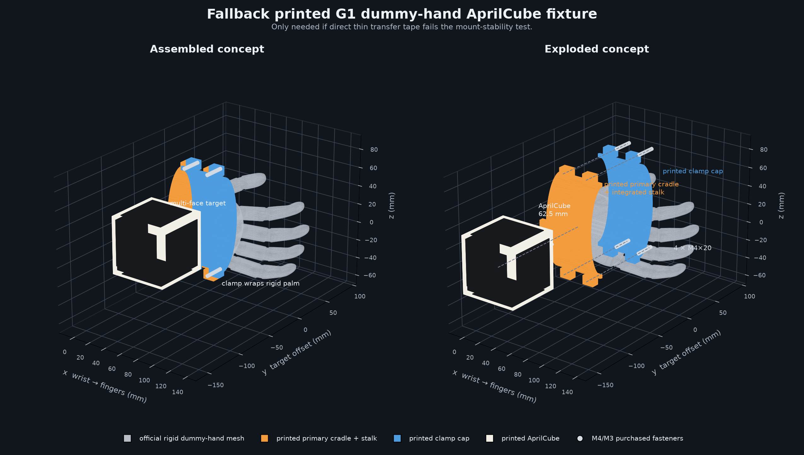

# AprilCube Mount for the G1 Dummy Hand

> **Current decision (2026-08-03):** Place the existing rounded 40 mm
> AprilCube directly on the **left** rigid rubber-hand palm with the purchased
> double-sided mounting tape, approximately as shown in the supplied robot
> photo. No printed fixture, clamp, fastener, or separately printed base is part
> of the prototype. The white layer visible below the cube is tape.

## Current modeled placement and collision envelope

The arm side is configuration, with this installation selecting:

```yaml
calibration_arm: left
carrier_link: left_rubber_hand
held_arm: right
```

The exact optical transform is not assumed. The optimizer still estimates the
full six-DoF `left_rubber_hand_T_aprilcube`, so the taped face and small rotation
errors do not bias the camera result.

For motion planning only, the known target size and photographed placement are
represented by a deliberately oversized hand-frame-aligned AABB:

```yaml
name: aprilcube_envelope
parent_link: left_rubber_hand
xyz_m: [0.040, -0.034, 0.000]
size_m: [0.060, 0.058, 0.060]
rpy_rad: [0.0, 0.0, 0.0]
```

The nominal cube is 40 mm per side at approximately
`[0.040, -0.033, 0.000] m`. The larger box includes the visible tape footprint
and at least 5 mm modeling/placement allowance around its approximately 50 mm
planar extent. This collision box is not used as the optical calibration prior.

The rest of this document records the earlier clamp exploration for history.
It is superseded for the current prototype and must not be treated as the bill
of materials or mounting instruction.

## Superseded clamp exploration

## MVP recommendation: direct adhesive mounting

The physical dummy hand has a broad, flat, rigid palm and the existing AprilCube
can sit on it with a full-face contact. For the first calibration dataset, use
the Scotch foam mounting tape that has already been purchased. Its rated holding
strength is easily sufficient for the approximately 40 g cube. The only open
question is whether the installed cube keeps one constant pose relative to the
hand, which will be measured rather than assumed.

- Clean the palm and cube face with isopropyl alcohol and let both dry.
- Cover most of the mating face so peel and rocking loads are distributed.
- Keep the cube in the proximal/central palm region shown in the physical fit
  check, away from flexible fingers and close to the wrist.
- Add witness marks at two cube corners so any shift is immediately visible.
- The covered bottom marker does not matter; AprilCube estimates pose from the
  remaining visible markers.

The exact hand-to-cube pose does not need to be measured or reproduced. It is a
free transform in the optimizer. It only needs to stay rigidly constant during a
single capture dataset. If the cube is removed, solve its mount transform again
on the next calibration run.

Keep wrist roll, pitch, and yaw fixed throughout the dataset. Before collecting
the main dataset, record a stationary baseline, move slowly through several
shoulder/elbow poses, and return to the exact same full arm joint vector after
each excursion. Compare repeated-anchor corner residuals against stationary
detector noise. Repeat the anchor after 15 minutes to expose short-term creep.
If measured drift persists after checking surface preparation, use the printed
fallback below.

Foam compliance is not automatically a calibration error. It matters only if
load changes cause the cube-to-hand transform to change. The protocol minimizes
that risk with a light target, slow motion, stationary captures, fixed wrist
joints, and repeated anchor measurements. No replacement tape purchase is part
of the MVP.

## Printed fallback: keyed clamshell



The render uses the official Unitree dummy-hand STL at URDF scale. The oval
clamshell, clearance, target offset, and flange locations are a communication
model—not printable CAD—until checked against physical measurements and camera
visibility.

Use the dummy-hand configuration and attach a keyed, two-piece clamshell directly
to the rigid dummy hand. Although the URDF calls this link `right_rubber_hand`, the
physical dummy hand is not meaningfully deformable, so it can serve as a stable
fixture surface.

A dedicated flange that temporarily replaces the dummy hand remains an
alternative if clamshell removal/reinstallation is not repeatable enough. A Dex3
finger grasp and hook-and-loop mounting are not part of the first calibration
protocol; the taped rigid dummy palm is.

### Manufacturing constraint

All custom geometry must be FDM 3D printed; no machining is available. The
preferred assembly therefore has only three custom printed pieces:

1. primary hand cradle with an integrated short target stalk;
2. clamp cap; and
3. AprilCube target.

The current design uses this exact purchased hardware:

| Quantity | Fastener | Purpose |
|---:|---|---|
| 4 | M4 x 20 mm ISO 4762 socket-head cap screw | Join the two clamshell halves |
| 4 | M4 DIN 985 nyloc nut | Captive clamshell nuts |
| 4 | M4 ISO 7089 flat washer | Distribute screw-head load on the print |
| 2 | M3 x 16 mm ISO 4762 socket-head cap screw | Attach AprilCube to keyed stalk flange |
| 2 | M3 DIN 985 nyloc nut | Captive AprilCube-mount nuts |
| 2 | M3 ISO 7089 flat washer | Distribute screw-head load on the print |

The clamshell will have two short side flanges on each side. Each M4 screw crosses
only the printed flange pair, not the full width of the hand; this is why a 20 mm
screw is sufficient. The AprilCube will have one non-marker mounting face with an
asymmetric key and two M3 holes, so it cannot be installed in a rotated pose.

CAD clearances will start at:

- M4 through-hole: 4.4 mm;
- M4 head counterbore: 7.5 mm diameter;
- M4 nyloc nut trap: 7.3 mm across flats, 5.5 mm deep;
- M3 through-hole: 3.4 mm;
- M3 head counterbore: 6.0 mm diameter; and
- M3 nyloc nut trap: 5.7 mm across flats, 4.5 mm deep.

These are starting dimensions for a typical 0.4 mm-nozzle FDM printer. A small
hole/nut-trap coupon should be printed first and the clearances adjusted for the
actual printer. No heat-set inserts or machined features are required. Assembly
uses 3 mm and 2.5 mm hex keys.

If purchased screws and nuts are not allowed, an all-printed wedge or cam latch
can be designed instead, but it must pass a stricter reinstallation test because
printed latches creep and wear more easily.

### Why this interface

For the mode-5 model, `right_hand_palm_joint` is a fixed joint:

```text
parent: right_wrist_yaw_link
child:  right_rubber_hand
xyz:    [0.0415, -0.003, 0] m
rpy:    [0, 0, 0] rad
```

This gives us a clean kinematic chain with no finger joints. The official dummy
hand mesh has an approximate envelope of 131.8 x 66.6 x 106.5 mm. It is a useful
starting surface for a conformal cradle and collision visualization, but physical
measurements are still needed to set print clearance and verify that the mesh
matches the manufactured hand.

The optimizer will estimate the fixed `right_rubber_hand` to AprilCube transform,
so the attachment does not need to place the cube at a perfectly measured
nominal pose. It does need to keep one constant transform throughout a dataset.

### Concept A: Rigid-hand clamshell

1. Select a broad, geometrically distinctive region near the base of the dummy
   hand that does not interfere with wrist-yaw motion.
2. Make the dorsal half the primary cradle. Give it three separated hard contact
   pads, an axial end stop, and an asymmetric side/key feature.
3. Use a second shell as the clamp cap. Four M4 x 20 mm screws—two through short
   flange pairs on each side—provide even preload. No foam or compliant liner
   should sit between the locating pads and hand.
4. Integrate the short AprilCube support into the primary cradle, or use a keyed
   dovetail plus two screws so it cannot be assembled in another orientation.
5. Add witness marks across both clamshell seams and the target interface.

Benefits:

- no need to remove or modify the dummy hand;
- no Dex3 articulation, finger controller, or grasp force involved;
- a large rigid surface for anti-rotation registration; and
- the optimizer can estimate the exact fixed mount transform.

The first CAD can use the official STL as its nominal negative surface with a
small print clearance. Caliper measurements and a low-cost fit coupon should set
the final clearance before printing the complete target mount.

### Concept B: Replacement calibration flange

If the clamshell fails the reinstall-repeatability test, remove the dummy hand and
reuse its existing fasteners and locating features for a dedicated calibration
flange. The flange should have:

- a flat seating face against the wrist interface;
- a close-fitting pilot/key to prevent lateral slip and rotation;
- printed counterbores and captive nut traps for the specified M4 fasteners;
- a short, stiff target arm; and
- a keyed target attachment.

This costs more handling effort but provides the strongest direct registration to
`right_wrist_yaw_link`.

### Target geometry

Start with the already printed rounded model at
`aprilcube/models/dex3_safe_cube`: 40 mm outer dimensions, 3 mm tangent
edge/corner radius, and six 30 mm OpenCV ArUco `4x4_100` markers, one per face.
The rounded perimeter stays outside the planar marker geometry. The taped face
is hidden; the other five remain usable. Reprint a larger target only if the
physical detector qualification shows inadequate corner size, visibility, or
repeatability at the actual head-to-hand distances.

### Information required for CAD

Photograph the entire right dummy hand and its wrist connection:

1. dorsal/top view;
2. palm/bottom view;
3. both side views;
4. end-on view of the wrist interface; and
5. close-ups of every accessible fastener and locating feature.

Include a ruler in each photograph. Measure with calipers where possible:

- fastener count, thread size, and center-to-center pattern;
- screw head diameter and available engagement length;
- dummy-hand width, height, and circumference at two candidate clamp sections;
- distance from each section to the wrist seam;
- wrist pilot/boss diameter and depth if the replacement-flange option is kept;
- wrist mating-face width and height;
- any key, slot, flat, dowel, or asymmetric feature;
- clearance to the wrist-yaw housing through its full rotation.

Do not infer a printable clamp solely from the STL surface. The real hand
measurements are the fit authority. Validate clearance with a small printed slice
of the cradle before spending time and material on the full assembly.

### Commissioning checks

1. Install the fixture, torque its fasteners consistently, and apply witness marks.
2. Keep the robot unpowered or in a safe damped/manual state for the first camera
   visibility test.
3. Detect the stationary target for at least 30 seconds and record pose noise.
4. Move through a few slow, supported arm poses and verify visibility and collision
   clearance before collecting calibration data.
5. Remove and reinstall the fixture three times. Treat each installation as a
   separate trial and quantify target-pose repeatability.
6. Reject any design that visibly flexes, shifts, or changes pose under gentle hand
   loading.
